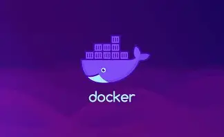

# Docker 

# What is a Docker 
   **Docker is a tool that helps you package an application along with everything it needs like libraries, settings, and dependencies, so that it can run the same way on any computer or any environment.**

-  What is the difference between Virtualization and  Dockerization

  
<b>Virtualization (click to expand)</b>

Virtualization is a technology that allows you to create multiple virtual machines on a single physical computer, where each virtual machine has its own operating system, resources, and environment. It isolates hardware.

#### 🚀 Examples: Virtualization is like:
- ✅ setting up a full new house
- ✅ with its own bedroom, kitchen, bathroom, electricity
- ✅ even if you just want to make Maggi

#### 🚀 So a Virtual Machine has:
- ✅ full operating system
- ✅ heavy setup
- ✅ needs more RAM & CPU
- ✅ slow to start

 

  
<b>Dockerization (click to expand)</b>

Dockerization is the process of packaging an application along with its required libraries, configurations, and dependencies into a lightweight container so it can run consistently in any environment. It isolates applications.

#### 🚀 Examples: Dockerization is like:
- ✅ bringing your own tiffin
- ✅ you can eat anywhere without tension
- ✅ same taste everywhere

#### 🚀 So a Docker Container has:
- ✅ only the app and what it needs
- ✅ lightweight setup
- ✅ uses less RAM & CPU
- ✅ starts in seconds

  
<b>Docker Commands (Containers, Ports, Force Delete, Volumes, Networks, Cleanup)</b>

### ✅ `docker run nginx`
Runs a container using the `nginx` image.

### ✅ `docker run -d <image-name>`
Runs a container in background mode (detached).

### ✅ `docker run -d -p 8080:80 <image-name>`
Runs a container with port mapping, connecting host port **8080** to container port **80**.

### ✅ `docker stop <container_id_or_name>`
Stops a running container gracefully.

### ✅ `docker start <container_id_or_name>`
Starts a previously stopped container.

### ✅ `docker restart <container_id_or_name>`
Restarts a container in a single command.

### ✅ `docker rm <container_id_or_name>`
Removes a stopped container.

### ✅ `docker rm -f <container_id_or_name>`
Force deletes a running container (kills + removes).

---

### ✅ `docker images`
Shows all locally stored Docker images.

### ✅ `docker rmi <image_id_or_name>`
Removes an image (only if unused).

### ✅ `docker rmi -f <image_id_or_name>`
Force deletes an image even if containers depend on it.

---

### ✅ `docker volume ls`
Lists all Docker volumes.

### ✅ `docker volume create <volume-name>`
Creates a persistent storage volume.

### ✅ `docker volume rm <volume-name>`
Deletes a volume.

### ✅ `docker volume prune`
Deletes all unused volumes.

---

### ✅ `docker network ls`
Lists all Docker networks.

### ✅ `docker network create <network-name>`
Creates a custom network.

### ✅ `docker network rm <network-name>`
Deletes a network.

### ✅ `docker network inspect <network-name>`
Shows network details (IP range, attached containers, driver, etc.).

---

### ✅ `docker system df`
Shows disk usage by Docker components.

### ✅ `docker system prune`
Removes unused containers, networks, images (asks confirmation).

### ✅ `docker system prune -a`
Removes ALL unused images, not just dangling ones.

### ✅ `docker system prune -a --volumes`
Removes unused images, containers, networks AND volumes (maximum cleanup).

